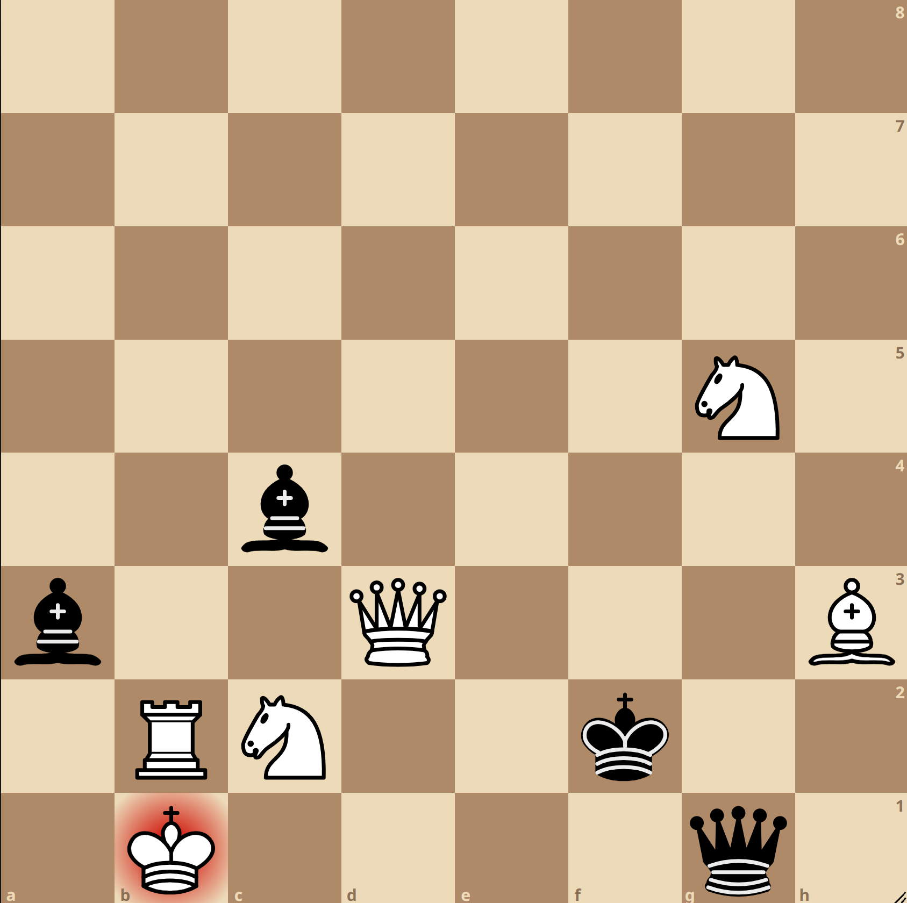

# Chess Puzzle Generator
 White to mate in 3

Chess puzzles generated using genetic to learn more about them. Configuration options in config.py and requires a chess engine to run. Inspired by [this blog](https://www.propelauth.com/post/generating-chess-puzzles-with-genetic-algorithms "Blog").